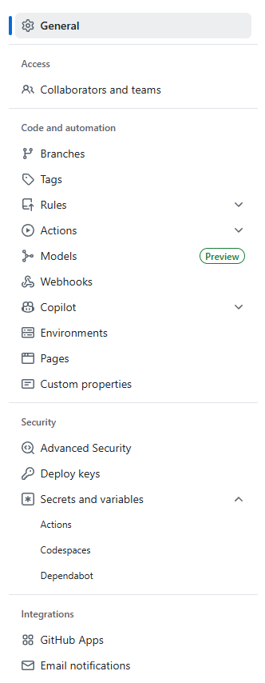
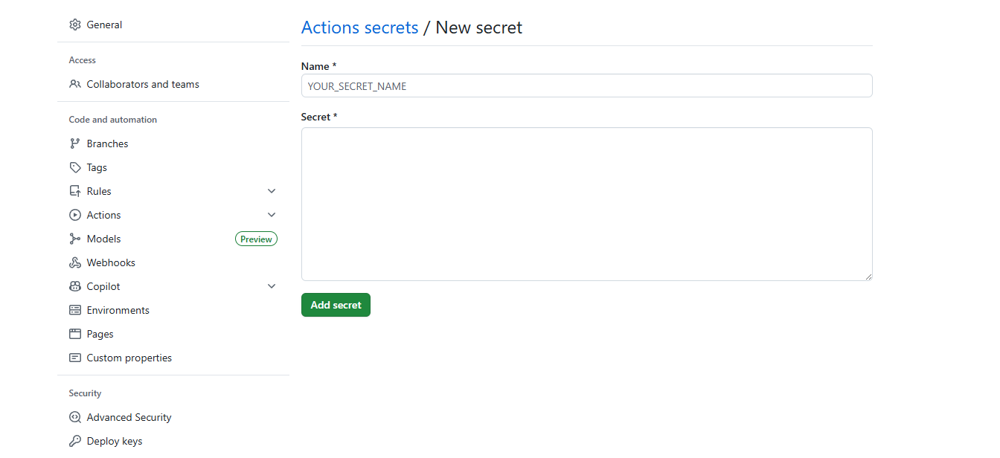
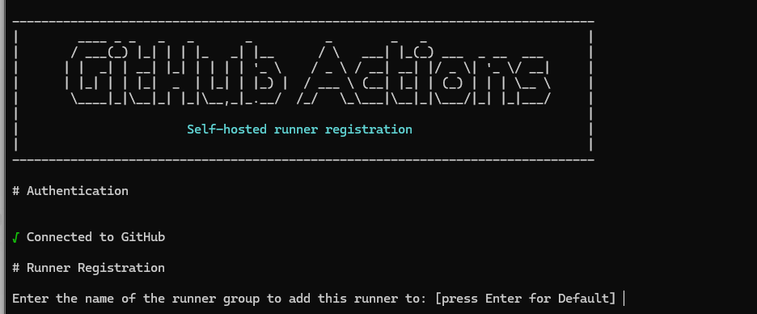
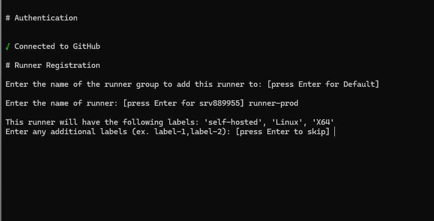
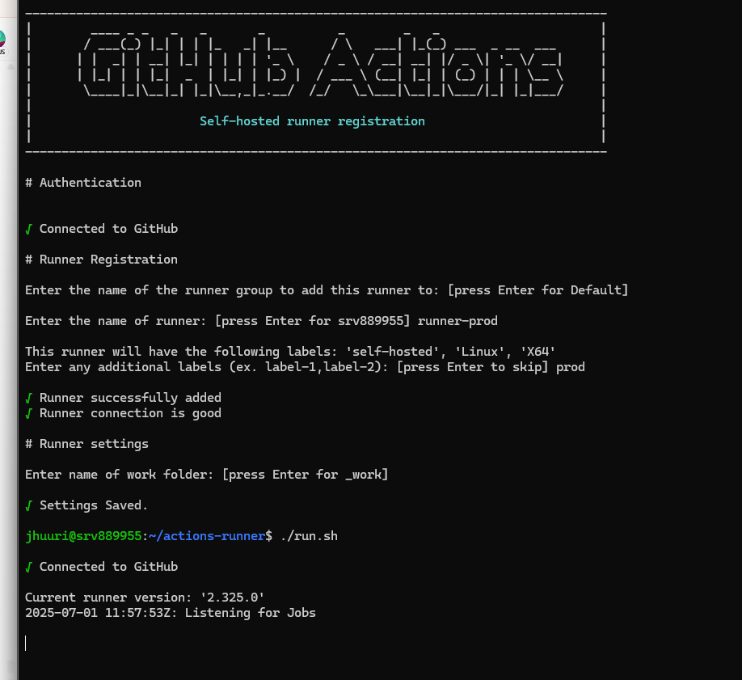

# 🚀 VPS CI/CD Setup (বাংলা গাইডসহ)

আমরা এখানে শিখবো কিভাবে একটি প্রজেক্টকে VPS-এ CI/CD (Continuous Integration & Continuous Deployment) এর মাধ্যমে অটোমেটিকভাবে ডিপলয় করা যায়। এই ডকুমেন্টেশনটি বাংলায় এবং ছবি সহ (যদি যুক্ত করেন) সহজভাবে উপস্থাপন করা হয়েছে।

---

## 📦 প্রজেক্টের কাঠামো

প্রজেক্টটি Turborepo অথবা Monorepo হতে পারে এবং বিভিন্ন সার্ভিস (যেমন: Backend, Frontend) আলাদাভাবে ব্যবস্থাপনা করা হবে।

---

## ⚙️ পূর্বশর্ত (Prerequisites)

1. ✅ VPS সার্ভার (Ubuntu 20.04+ সুপারিশকৃত)
2. ✅ Node.js (version 20)
3. ✅ GitHub Repository
4. ✅ Docker & Docker Compose (অথবা আপনি pm2 ব্যবহার করতে পারেন)
5. ✅ GitHub Actions
6. ✅ Self-hosted Runner

---

## 🧰 ধাপ ১: VPS এ Docker Setup

আমরা Docker ব্যবহার করব `pm2` এর পরিবর্তে, যাতে container-based isolated environment পাই।

---

### 🐳 ধাপ ১.৫: Docker ইনস্টলেশন (যদি না থাকে)

```bash
# সিস্টেম আপডেট এবং প্রয়োজনীয় প্যাকেজ ইন্সটল
sudo apt update
sudo apt install apt-transport-https ca-certificates curl software-properties-common -y

# GPG key এবং Docker repo যুক্ত করা
curl -fsSL https://download.docker.com/linux/ubuntu/gpg | sudo gpg --dearmor -o /usr/share/keyrings/docker-archive-keyring.gpg

echo \
  "deb [arch=$(dpkg --print-architecture) signed-by=/usr/share/keyrings/docker-archive-keyring.gpg] \
  https://download.docker.com/linux/ubuntu \
  $(lsb_release -cs) stable" | sudo tee /etc/apt/sources.list.d/docker.list > /dev/null

# Docker ইন্সটল করা
sudo apt update
sudo apt install docker-ce docker-ce-cli containerd.io -y

# root ছাড়া docker চালাতে চাইলে
sudo usermod -aG docker $USER
```

🔄 **এক্সিট করে আবার লগইন করুন** অথবা নতুন টার্মিনাল খুলুন।

---

### ✅ Docker ও Docker Compose চেক


```bash
docker --version
docker-compose --version
```

---

## 🛠️ ধাপ ২: Turborepo-based CI/CD কনফিগারেশন

### 📁 `.github/workflows/deploy.yml`

```yaml
name: Deploy to VPS via Self-Hosted Runner

on:
  push:
    branches: [main]

jobs:
  deploy:
    runs-on: self-hosted

    steps:
      - uses: actions/checkout@v3

      - name: Setup Node.js
        uses: actions/setup-node@v3
        with:
          node-version: 20

      - name: Install dependencies
        run: npm install

      - name: Build Docker Images (only touched apps)
        run: npx turbo run build --filter="...[origin/main]"

      - name: Deploy Docker Containers (only touched apps)
        run: npx turbo run deploy
```

---

## 🐋 ধাপ ৩: Dockerfile তৈরি (`apps/navigation` উদাহরণ)

📁 `Dockerfile`

```Dockerfile
FROM node:20
WORKDIR /app

COPY ./package*.json ./
COPY ./apps/navigation/package*.json ./apps/navigation/
COPY ./apps/navigation ./apps/navigation
COPY ./packages ./packages

COPY .env .env

RUN npm install

WORKDIR /app/apps/navigation

EXPOSE 4000

CMD ["node", "index.js"]
```

---

## 🧩 Root Level `package.json` (Monorepo Setup)

```json
{
  "name": "vps-ci-cd-monorepo",
  "private": true,
  "workspaces": [
    "apps/*",
    "packages/*"
  ],
  "scripts": {
    "build": "turbo run build",
    "deploy": "turbo run deploy"
  },
  "devDependencies": {
    "turbo": "^1.12.0"
  }
}
```

---

## 🧩 `apps/navigation/package.json`

```json
{
  "name": "navigation",
  "version": "1.0.0",
  "scripts": {
    "build": "echo '✅ Building navigation service'",
    "deploy": "docker build -t navigation-app . && docker stop navigation-app || true && docker rm navigation-app || true && docker run -d --name navigation-app -p 4000:4000 navigation-app"
  },
  "dependencies": {
    "express": "^4.18.2"
  }
}
```

---

## 🧑‍💻 Self-hosted Runner Setup (নতুনদের জন্য)

### ✅ Step 1: GitHub Repo থেকে Runner তৈরি

1. Repo → Settings → Actions → Runners


2. ➕ **New self-hosted runner**
3. Platform: `Linux`, Architecture: `x64`
4. GitHub যে কমান্ডগুলো দেয় সেগুলো রান করুন:

```bash
mkdir actions-runner && cd actions-runner
curl -o actions-runner-linux-x64.tar.gz -L https://github.com/actions/runner/releases/download/v2.308.0/actions-runner-linux-x64-2.308.0.tar.gz
tar xzf ./actions-runner-linux-x64.tar.gz
./config.sh --url https://github.com/USERNAME/REPO --token YOUR_TOKEN
```

---

## 🚀 Runner চালানোর দুইটি মোড:

### 🅰️ `./run.sh` — টার্মিনাল ভিত্তিক চালনা

```bash
./run.sh
```

- শুধু টার্মিনাল খোলা থাকলে কাজ করবে।
- টার্মিনাল বন্ধ করলেই Runner বন্ধ হয়ে যাবে।

---

### 🅱️ `./svc.sh` — Detachment Mode (Always Running in Background)

```bash
./svc.sh install
./svc.sh start
```

- এটি system-level background সার্ভিস হিসেবে রান করে।
- VPS রিবুট হলেও runner চালু থাকবে।

> **Note**: `./svc.sh` ব্যবহার করলে runner সবসময় background এ চলবে, টার্মিনাল বন্ধ হলেও বন্ধ হবে না। এটিকে বলা হয় **detached mode** — production এর জন্য Best Practice।

---

## ✅ শেষ ধাপ: ডিপ্লয় টেস্ট করুন

1. `main` ব্রাঞ্চে commit/push দিন
2. GitHub Actions → `Deploy to VPS` দেখুন চলেছে কিনা
3. VPS এ গিয়ে `docker ps` দিয়ে container চলছে কিনা চেক করুন

---

# চাইলে আপনি dynamic ভাবেও করতে পারেন, সেটাও আমি দেখাচ্ছি

## এবার আমরা আগে env variable গুলো গিঠাবে সেটআপ করে নিবো । 

প্রথমে আমরা আমাদের নির্দিষ্ট রিপোতে যাবো, 
 - তারপর **setting** এ যাবো
 - তারপর **Secreats and variables** এ যাবো



 - এখান থেকে  **actions**  চোস করবো 


 - তারপর **New repository secret** এ যাবো


 - এখানে আমরা আমাদের env variable গুলো দিতে পারবো, যেহেতু আমরা ডাইনামিক ব্যবহার করতেছি তাই আমরা এভাবে দিব 



 ```bash
PROD_NODE_ENV 
 ```

 ```bash
DEV_NODE_ENV 
 ```

এভাবে সব গুলো একে একে বসাবো , তারপর আমরা আমাদের Vs code  এ চলে যাব , এবং তাঁর রুট ডিরেক্টরিতে গিয়ে এমন কোড দিব

### 📁 `.github/workflows/deploy.yml`

```bash
name: Deploy to VPS via Self-Hosted Runner

on:
  push:
    branches:
      - main
      - dev

jobs:
  deploy-prod:
    if: github.ref == 'refs/heads/main'
    runs-on: [self-hosted, prod]
    env:
      ENV_TYPE: PROD

    steps:
      - name: 📅 Checkout repository
        uses: actions/checkout@v3

      - name: 🛠️ Setup Node.js
        uses: actions/setup-node@v3
        with:
          node-version: 20

      - name: 💡 Generate .env file dynamically
        run: |
          touch .env
          echo "ENV_TYPE=${{ env.ENV_TYPE }}" >> .env
          echo "NODE_ENV=${{ secrets.PROD_NODE_ENV }}" >> .env
          echo "MONGO_URI=${{ secrets.PROD_MONGO_URI }}" >> .env
          echo "REDIS_DYNAMIC=${{ secrets.PROD_REDIS_DYNAMIC }}" >> .env
          echo "REDIS_PORT=${{ secrets.PROD_REDIS_PORT }}" >> .env
          echo "RABBITMQ_HOST=${{ secrets.PROD_RABBITMQ_HOST }}" >> .env

      - name:  Preview .env Summary
        run: |
          echo "--- ENV Loaded ---"
          grep -E '^(ENV_TYPE|NODE_ENV|BACKEND_URL|FRONTEND_URL)' .env
          echo "------------------"

      - name:  Install dependencies
        run: npm install

      - name:  Build Docker Images
        run: npx turbo run build --filter="...[origin/${{ github.ref_name }}]"

      - name:  Deploy Docker Containers
        run: npx turbo run deploy

  deploy-dev:
    if: github.ref == 'refs/heads/dev'
    runs-on: [self-hosted, dev]
    env:
      ENV_TYPE: DEV

    steps:
      - name: 📅 Checkout repository
        uses: actions/checkout@v3

      - name: 🛠️ Setup Node.js
        uses: actions/setup-node@v3
        with:
          node-version: 20

      - name: 💡 Generate .env file dynamically
        run: |
          touch .env
          echo "ENV_TYPE=${{ env.ENV_TYPE }}" >> .env
          echo "NODE_ENV=${{ secrets.DEV_NODE_ENV }}" >> .env
          echo "MONGO_URI=${{ secrets.DEV_MONGO_URI }}" >> .env
          echo "REDIS_DYNAMIC=${{ secrets.DEV_REDIS_DYNAMIC }}" >> .env
          echo "REDIS_PORT=${{ secrets.DEV_REDIS_PORT }}" >> .env
          echo "RABBITMQ_HOST=${{ secrets.DEV_RABBITMQ_HOST }}" >> .env

        

      - name:  Preview .env Summary
        run: |
          echo "--- ENV Loaded ---"
          grep -E '^(ENV_TYPE|NODE_ENV|BACKEND_URL|FRONTEND_URL)' .env
          echo "------------------"

      - name:  Install dependencies
        run: npm install

      - name:  Build Docker Images
        run: npx turbo run build --filter="...[origin/${{ github.ref_name }}]"

      - name: 🚁 Deploy Docker Containers
        run: npx turbo run deploy

```

এখন আমরা ডাইনামিক করে দিছি, এবং কোন ব্রাঞ্চে কিরকম ডিপ্লয় হবে এবং কোন রানার কোন টা ডিপ্লয় করবে ।
<span style="color:red">**আমাদের DockerFile আগের মতোই হবে **</span>

এখন আমরা চলে যাবো আমাদের repository setting এ এবং সেখানে runner  চলে যাব , 
- New runner -> New self-hosted runner

### ✅ Step 1: GitHub Repo থেকে Runner তৈরি

1. Repo → Settings → Actions → Runners


2. ➕ **New self-hosted runner**


3. Platform: `Linux`, Architecture: `x64`
4. GitHub যে কমান্ডগুলো দেয় সেগুলো রান করুন:

```bash
mkdir actions-runner && cd actions-runner
curl -o actions-runner-linux-x64.tar.gz -L https://github.com/actions/runner/releases/download/v2.308.0/actions-runner-linux-x64-2.308.0.tar.gz
tar xzf ./actions-runner-linux-x64.tar.gz
./config.sh --url https://github.com/USERNAME/REPO --token YOUR_TOKEN
```

---

## 🚀 Runner চালানোর দুইটি মোড:
এখানে কিছু এক্সা কাজ করা লাগবে , আমি sshort  দিয়ে দিচ্ছি ,

### এমন ***Enter the name of the runner group to add this runner to: [press Enter for Default]***
তাহলে  Enter চাপ দিয়ে দিন ।



তারপর যদি এইরকম আসে 
```bash
Enter the name of runner: [press Enter for srv889955]
```
যেহেতু আমরা ডাইনামিক করতেছি তাই আমরা কাস্টম নেইম দিব, 

```bash
runner-prod

```
তারপর যদি চায় 

 ```
Enter any additional labels (ex. label-1,label-2): [press Enter to skip]
```

তাহলে আমরা লিখে দিব 
 ```
 prod
```




### 🅰️ `./run.sh` — টার্মিনাল ভিত্তিক চালনা

```bash
./run.sh
```

- শুধু টার্মিনাল খোলা থাকলে কাজ করবে।
- টার্মিনাল বন্ধ করলেই Runner বন্ধ হয়ে যাবে।

---

### 🅱️ `./svc.sh` — Detachment Mode (Always Running in Background)

```bash
./svc.sh install
./svc.sh start
```

- এটি system-level background সার্ভিস হিসেবে রান করে।
- VPS রিবুট হলেও runner চালু থাকবে।

> **Note**: `./svc.sh` ব্যবহার করলে runner সবসময় background এ চলবে, টার্মিনাল বন্ধ হলেও বন্ধ হবে না। এটিকে বলা হয় **detached mode** — production এর জন্য Best Practice।

---

একই ভাবে চাইলে আমরা dev branch এর জন্য করতে পারি, কেনল নাম চেঞ্জ করে দেও্যা লাগবে , আর বাকি প্রসেস সব আগের মতোই, এখন dev and prod এর জন্য দুটো আলাদা রানার কাজ করবে ইন শাহ আল্লাহ
ধন্যবাদ